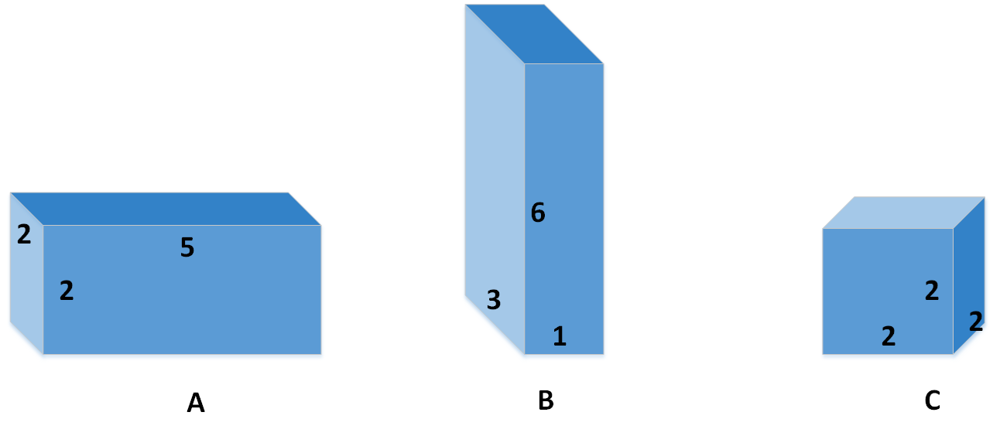
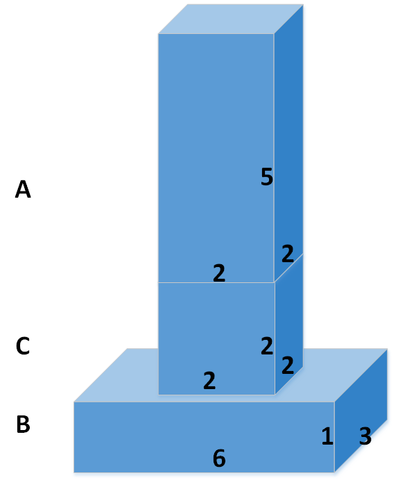

## Box Stacking Problem

#### Description

- Given N cubic boxes, stack them in order to acquire the maximal height.
- While stacking, an box should be perfectly stacked on the other. The term "perfect" will be explained in the following context.
- The width, length and height of these boxes are all integer numbers within [1, 10000].
- Boxes can be rotated.
- It is not necessary to use all the boxes.

For instance, given three boxes A, B, C,

the maximum height after stacking is 8. A possible stacking scheme is shown as follows.

**Perfect Stacking**

As you can tell from the above scheme, no part of the upper box can be seen from the bottom of the box beneath. We can call such stacking as "perfect stacking". Here are some scenarios that boxes are not perfectly stacked.

