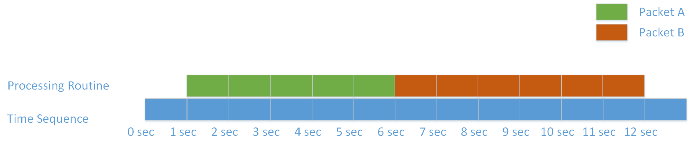

## Packet Queueing

A server is running to process incoming packets. The processing time is proportional to the length of the packet. For example, given a packet with length of 6, the processing time is 6 seconds; given a packet with length of 3, the processing time is 3 seconds. Packets come in with a time-sequential manner. For instance, for packet A with length of 5 coming at time point 1 (second) and packet B with length of 6 coming at time point 3 (second), A possible processing routine will be: 



Here, let's give a few explanations to the diagram. 

- At time point 1, packet A came in. As there was no packet being processed, the CPU started processing packet A immediately. 
- At time point 3, packet B arrived. As the CPU was busy processing packet A, packet B had to be put in a queue waiting for the CPU being idle.
- At time point 6, the CPU finished processing packet A and it started to process packet B at once.
- At time point 12, the CPU finished processing packet B. Job done!

#### Total Processing Time (TPT)

As we can see, packet B had been waiting in the queue for 3 seconds before being processed. Here, we use term "**total processing time**", or **TPT**, to denote the time span from the arrival of a packet to the time when the processing on that packet has just finished. In above case, the TPT of packet A was 5 seconds (waiting for 0 seconds and processing for 5 seconds), while the TPT of packet B was 9 (waiting for 3 seconds and processing for 6 seconds). 

However, if the TPT of a packet is larger than 10 seconds, we say the processing on that packet is "timed out". Luckily, no packet processing was timed out in the above routine. However, if we change the length of packet B to 8, then there will be no way to manage a routine that prevents both packet from being timed out.

#### Multiple CPUs

Fortunately, we can harness more CPUs concurrently. Timeout will be eliminated by using another CPU for above case. The following diagram shows the scenario.


As we can see, by using one more CPU, the TPT of packet A is 5 seconds and the TPT of packet B is 6 seconds. Even though we change the length of packet B to 8, the TPT is 8 and the processing is still not timed out.

#### The Objective

Here comes the objective of the task: write a program to calculate the minimal number of CPU used by a set of routines that process the incoming packets. No timeout should occur on each routine. The maximal number of available CPU is 5. If you use out all available CPUs and cannot determine a routine set to eliminate timeout, then output "-1".

In the previous example, the answer is 1, meaning that only one CPU is necessary for performing a non-timeout processing. If we change the length of packet B to 8, then the answer will be 2, which means at least two CPUs must be used to process both packets without timeout. Let's take a look at another example. If there are 6 incoming packets A[1, 10], B[2, 10], C[3, 10], D[4, 10], E[5, 10], F[6, 10]. there is no way to manage a routine set that makes all TPTs less or equal than 10 with maximal 5 CPU working simultaneously. Thus, the answer is "-1".

#### I/O Formats

Input Format

```
3
2
1 5
2 4
3
2 6
3 5
4 10
6
3 8
4 9
4 10
5 8
6 9
6 10
```

Descriptions:

- The number in the first line tells the number of total test cases.
- Then follows each test case. For the first test case, the total number of the incoming packets is 2, according to the number in the second line.
- Then follows each incoming packet. For the first incoming packet in the first test case, the length of the packet is 5 and the arrival time point is 1; for the second incoming packet in the first test case, the length of the packet is 4 and the arrival time point is 2.
- Arrival time point can be same for two or more packets in a test case.
- The total number of the incoming packets is within [1, 1000].
- The arrival time point of a packet is within [0, 5000].
- The length of a packet is within [1, 10].

Output Formats

```
#1 1
#2 2
#3 -1
```

Descriptions:

- The answer lies behind `#case-id` separated by a blank.

#### Restrictions

- Total running time of your program should be less than 5 seconds for maximal 50 arbitrary test cases.
- No libraries should be used by your program except for `<iostream>` and `<fstream>`.